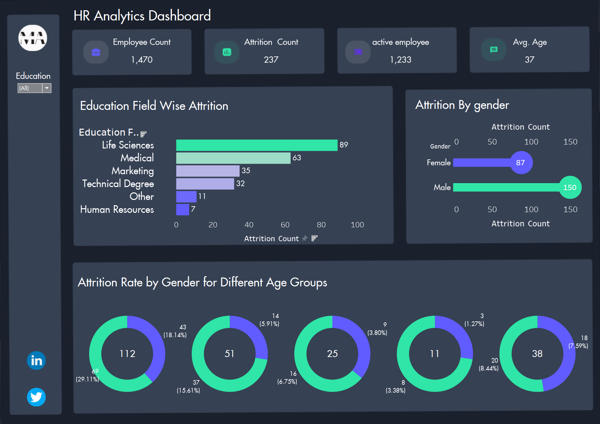

## HR-Analytics-Tableau-Dashboard

In this repository I will be using tableau for HR Analytics and for creating a Dashboard/Report.
 

## Tableau:  

It is a business intelligence tool used for data visualization, data analysis and story telling.

   •Data visualization is a graphical representation of data and information. you can do it using charts, graphs, tables and maps.
   

   •Tableau is used for exploratory data analysis to notice the trends and patterns in data. you can produce dashboard which helps busineses to monitor their performances. you can also connect the 
    several types of data sources like mongoDB, postgres and more.
  
  
 ## Dashboard:
Below is the picture of dashboard I have created using tableau. 
<be /> 

 
